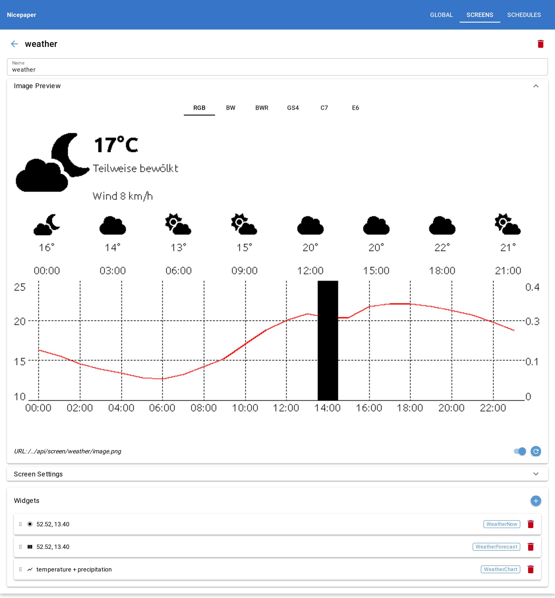
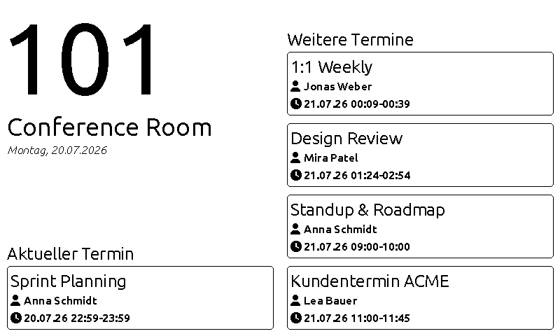
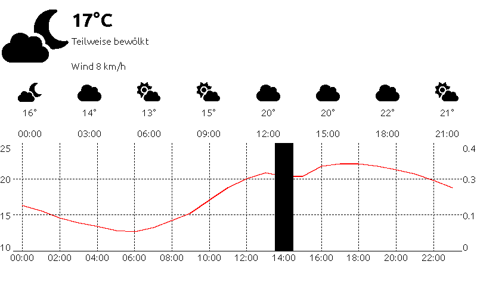
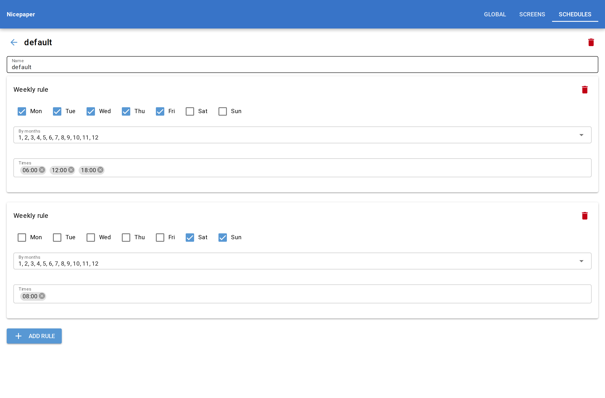

# Nicepaper

A web application that renders screens — door signs with room calendars,
weather boards, info displays — as PNG images for e-paper displays. It is
built with FastAPI (a REST API for the displays) and NiceGUI (a management
UI), and runs standalone or as a [nice4iot](https://github.com/clausgf/nice4iot)
extension (`extensions.epaper`).

Displays poll the API for their image; the server renders screens from JSON
configuration files, caches the result, and answers with proper
`ETag`/`Cache-Control` headers so displays only download a new image when the
content actually changed.

<p align="center">
  
</p>

## Contents

- [Features](#features)
- [Quick Start](#quick-start)
- [Screenshots](#screenshots)
- [Documentation](#documentation)
- [Roadmap](#roadmap)
- [Contributing](#contributing)
- [Licence](#licence)

---

## Features

- **Screens from JSON** — layouts made of widgets (`Text`, `Date`,
  `RoomCalendar`, `WeatherNow`, `WeatherForecast`, `WeatherChart`) rendered
  onto an RGB canvas with Pillow.
- **Room calendar** — fetches an iCal feed (with recurring-event expansion),
  caches it, and shows the current, next, and further appointments.
- **Weather** — current conditions, an hourly forecast strip, and a
  configurable temperature/precipitation chart, backed by
  [Open-Meteo](https://open-meteo.com) (no API key needed). Charts are
  hand-drawn with Pillow so they stay crisp on limited e-paper palettes.
- **E-paper color models** — render to `bw`, `bwr`, `gs4`, `c7`, or `e6` via
  the `color_model` query parameter.
- **Update schedules** — plain JSON weekly rules (weekdays, months, times)
  decide when a screen expires and is re-rendered.
- **Display aliases** — address a display by a stable friendly name; several
  displays can share one screen.
- **Management UI** — Screens and Schedules tabs: create/delete files, edit a
  screen's canvas and drag-reorderable widget list with live RGB/palette
  previews, and edit schedules as cards with inline validation.

See [Screens, widgets & schedules](docs/screens.md) for the configuration
formats and the ready-to-copy `examples/`.

## Quick Start

Requires Python 3.12+ and [uv](https://docs.astral.sh/uv/).

```bash
git clone https://github.com/clausgf/nicepaper.git
cd nicepaper
uv sync
mkdir -p data/screens data/schedules data/images data/ical
cp examples/schedules/default.json data/schedules/
cp examples/screens/simple.json data/screens/
uv run uvicorn main:app --reload
```

- Management UI: <http://127.0.0.1:8000/ui>
- API docs: <http://127.0.0.1:8000/docs>
- Display image: `http://127.0.0.1:8000/api/screen/simple/image.png`
  (optional `?color_model=bw|bwr|gs4|c7|e6`)

This standalone server is for development and debugging only. For a real
deployment nicepaper runs as a
[nice4iot](https://github.com/clausgf/nice4iot) extension — see
[Architecture](docs/architecture.md). More detail in
[docs/development.md](docs/development.md).

## Screenshots

**Door sign** — the `RoomCalendar` widget renders the current appointment and
upcoming ones for a room, here quantized to the black/white/red (`bwr`) palette.

<p align="center">
  
</p>

**Weather board** — current conditions, an hourly forecast strip, and a
combined temperature (line) and precipitation (bar) chart, hand-drawn for a
crisp result on the red accent palette.

<p align="center">
  
</p>

**Schedule editor** — update schedules are edited as one card per weekly rule,
with weekday checkboxes, a month multiselect, and time chips.

<p align="center">
  
</p>

## Documentation

Full documentation lives in [docs/](docs/README.md):

| Document | Contents |
|---|---|
| [Screens, widgets & schedules](docs/screens.md) | The JSON configuration formats, color models, aliases, and the `examples/` files |
| [Configuration](docs/configuration.md) | Process settings and environment variables |
| [Development](docs/development.md) | Install from source, run, tests, codec regeneration |
| [Architecture](docs/architecture.md) | Project layout and standalone vs. nice4iot extension mode |
| [LoRaWAN design notes](docs/design-lorawan.md) | Early design for client-side rendering on battery/LoRaWAN displays |
| [Security policy](SECURITY.md) | Intended security boundaries and how to report a vulnerability |

## Roadmap

- **API keys for the display API** — `/api` is currently protected by external
  middleware; an in-app `X-Api-Key` scheme is planned. See the
  [roadmap note](docs/development.md#api-keys-for-the-display-api).
- **LoRaWAN client-side rendering** — sending compact widget *data* to
  battery displays that render locally, instead of a rasterized PNG. See the
  [design notes](docs/design-lorawan.md).

## Contributing

Issues and pull requests are welcome — see [CONTRIBUTING.md](CONTRIBUTING.md)
for the development setup and project rules. Security issues should be reported
privately as described in [SECURITY.md](SECURITY.md).

## Licence

nicepaper is licensed under the **GNU Affero General Public License v3.0 or
later** (AGPL-3.0-or-later). The full text is in [LICENSE](LICENSE).

In short: you may use, modify, and redistribute it, provided derivative works
stay under the same licence. The AGPL additionally covers network use — **if you
run a modified version as a service that others interact with over a network,
you must offer them its source code.** Running an unmodified nicepaper carries no
such obligation.
